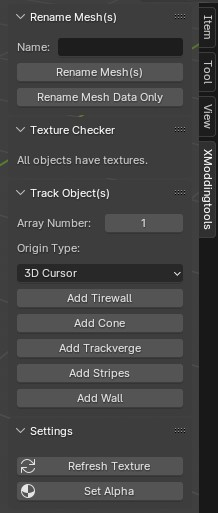

# XModdingtools for Blender

XModdingtools is a multilanguage Plugin for the 3D Program Blender. If you have created a lot of objects and want to change their names to RACESURFACE (example), you will need this addon. Above the sidebar (key: n) you will find a textbox after the installation. In this textbox you can write RACESURFACE selected your meshes and click on "rename mesh(s)" and voilà all your selected meshes now have the name: RACESURFACE_01, RACESURFACE_02 etc (including the mesh data name).

The second button is for people who only want to rename the mesh data names, but not the mesh names (important for export to fbx, obj,..). Select your meshes and click the button. After that the meshes will all have your name in both path.

***Functions:***
- rename selected meshes using a text box and a button (including mesh data name)
- rename only mesh data name from selected meshes 
- add track objects (Tirewall, Cone, Trackverge, Stripes, Wall, ...) including modifier array function
- refresh the materials of selected meshes
- set Textures to Alpha

***works in:*** > Blender 2.93, 3.6.1 (< v 0.2.0) and 4.0.2 (> v 0.2.5)

***Multilanguage:*** english and german
